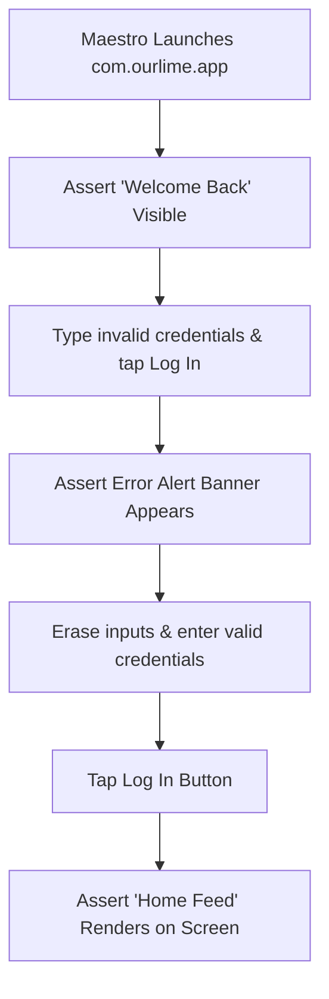
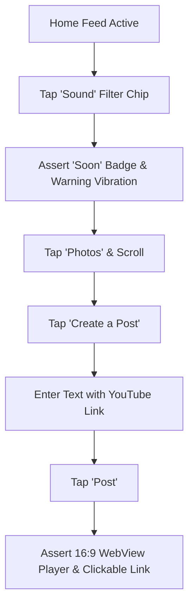
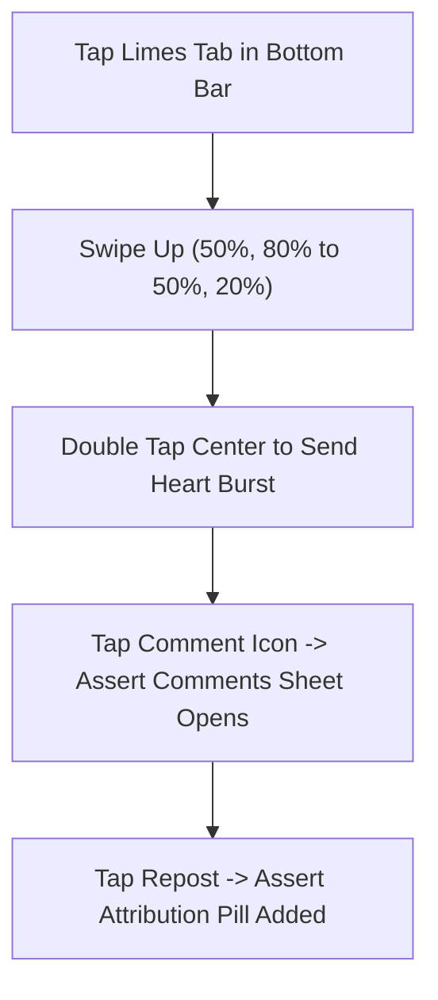
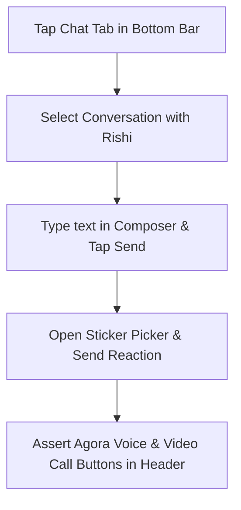
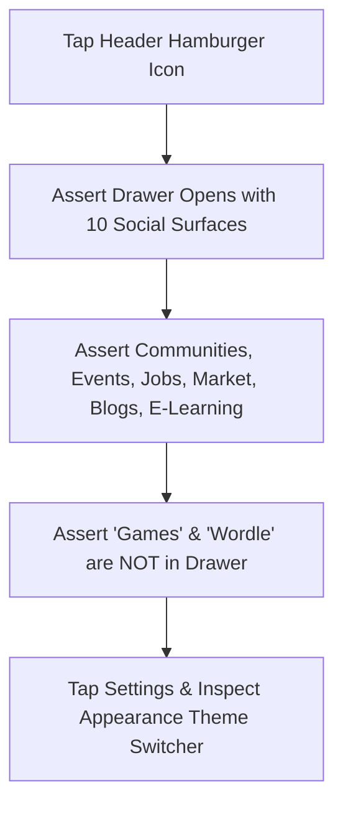

# Native Mobile E2E User Journey Maps — Ourlime Mobile

Visual Mermaid diagrams representing the exact physical user actions performed by Maestro on your connected mobile device.

---

## 1. Native Authentication & Form Validation (`01-auth-login.yaml`)

---

## 2. Feed Scrolling, Filters & YouTube Player (`03-feeds` & `04-feeds`)

---

## 3. Limes Vertical Snap Reels & Reposting (`05-limes-reels.yaml`)

---

## 4. Chat Messaging & Voice Notes (`06-chat-messaging.yaml`)

---

## 5. Navigation Drawer & Games Exclusion (`12-navigation-drawer.yaml`)

