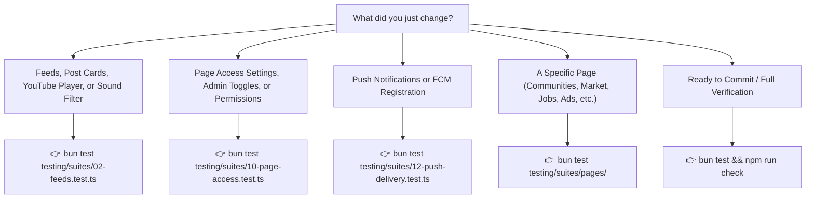

# Mobile Testing Guide — Ourlime Mobile

Comprehensive test suite and OOP Screen Object Models for Ourlime Mobile.

---

## 🚀 Quick Start

### 1. Run the Entire Test Suite

```bash
bun test
```

*(If PowerShell script execution is blocked on your terminal, run `cmd /c "bun test"`)*

---

## 2. Available Test Commands & When to Use Them

Here is a plain-English guide to testing commands in `package.json`:

#### ⚡ `bun test` (Fastest Local Feedback)
- **What it does:** Runs all 23 test suites across **every single page, component, and API endpoint**.
- **How it works:** Executes in-memory mock harnesses and Screen Object Models in milliseconds (~250ms) without touching production Firestore or needing an emulator.
- **When to use:** Use this as your **everyday development loop**. Whenever you change a component, update styles, modify service logic, or adjust permissions, run this to ensure zero regressions.

#### 🎯 Targeted Domain Commands
- **`bun test testing/suites/02-feeds.test.ts`** — Runs Feeds, Sound Soon filter, and YouTube video embed URL parsing.
- **`bun test testing/suites/10-page-access.test.ts`** — Runs Dynamic Real-Time Page Access & Admin toggle tests.
- **`bun test testing/suites/12-push-delivery.test.ts`** — Runs Google FCM Push Notification token validation.
- **`bun test testing/suites/pages/`** — Runs all 10 page test suites covering all 56 mobile app routes.

---

## 💡 Cheat Sheet: "Which command should I run?"



---

## 📁 Testing Architecture

```text
testing/
├── README.md                      # Complete testing guide & command cheat sheet
├── TEST-FLOW.md                   # Mermaid user journey maps for all test suites
├── config/                        # Test environment setup
├── mocks/                         # Deterministic Test Fixtures
│   ├── mockUsers.ts               # Test profiles (Admin, Dev, Premium, Regular)
│   ├── mockPosts.ts               # Feed posts (text, media, polls, YouTube URLs)
│   ├── mockChats.ts               # 1-on-1 messages, voice notes, timestamps
│   └── mockPageAccess.ts          # Firestore page access configurations
├── services/                      # OOP Test Harness Services
│   ├── AuthTestHarness.ts         # In-memory authentication & role switcher
│   └── ApiTestHarness.ts          # Next.js API mocks & status codes
├── screens/                       # OOP Screen Object Models (SOM)
│   ├── FeedsScreenObject.ts       # Feeds scrolling, filters, likes, YouTube embeds
│   └── AdminScreenObject.ts       # Page access toggles, permissions, navigation
└── suites/
    ├── 01-auth.test.ts            # Auth & Role Resolution
    ├── 02-feeds.test.ts           # Feeds & YouTube Embed Parsing
    ├── 03-chat.test.ts            # Chat & Messaging Status Flow
    ├── 04-limes.test.ts           # Limes Reels & Repost Attribution
    ├── 05-communities.test.ts     # Communities Directory & Roles
    ├── 06-events.test.ts          # Events Directory & RSVP Flow
    ├── 07-market.test.ts          # Marketplace Catalog & Bookmarks
    ├── 08-jobs.test.ts            # Job Board & Filter Flow
    ├── 09-blogs.test.ts           # Blogs & Article Reader Flow
    ├── 10-page-access.test.ts     # Dynamic Page Access Sync
    ├── 11-notifications.test.ts   # In-App Notifications
    ├── 12-push-delivery.test.ts   # Native FCM Push Token Validation
    ├── 13-api-services.test.ts    # Core Next.js API Endpoints
    └── pages/                     # Dedicated Page Route Suites (All 56 Routes)
        ├── 01-auth-pages.test.ts
        ├── 02-tab-pages.test.ts
        ├── 03-communities-pages.test.ts
        ├── 04-chat-and-post-detail-pages.test.ts
        ├── 05-marketplace-and-jobs-pages.test.ts
        ├── 06-events-and-blogs-pages.test.ts
        ├── 07-e-services-pages.test.ts
        ├── 08-ads-and-saved-pages.test.ts
        ├── 09-admin-portal-pages.test.ts
        └── 10-system-and-legal-pages.test.ts
```
