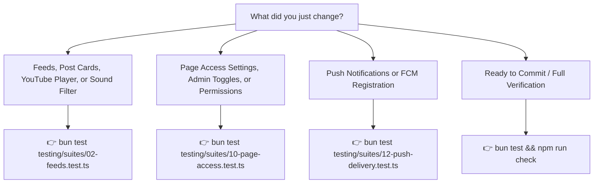

# Mobile Testing Guide — Ourlime Mobile

Comprehensive test suite and OOP Screen Object Models for Ourlime Mobile.

---

## 🚀 Quick Start

### 1. Run the Entire Test Suite

```bash
bun test
```

*(If PowerShell script execution is blocked on your terminal, run `cmd /c "bun test"`)*

---

### 2. Available Test Commands & When to Use Them

Here is a plain-English guide to testing commands in `package.json`:

#### ⚡ `bun test` (Fastest Local Feedback)
- **What it does:** Runs all feature test suites across Auth, Feeds, Chat, Communities, Limes, and Page Access.
- **How it works:** Executes in-memory mock harnesses and Screen Object Models in milliseconds without touching production Firestore or needing an emulator.
- **When to use:** Use this as your **everyday development loop**. Whenever you change a component, update styles, modify service logic, or adjust permissions, run this to ensure zero regressions.

#### 🎯 `bun test testing/suites/02-feeds.test.ts` (Targeted Suite Execution)
- **What it does:** Runs only the tests for Feeds, filter chips (Sound Coming Soon), and YouTube video embed URL parsing.
- **When to use:** Whenever you modify post components or video preview players.

#### 🛡️ `bun test testing/suites/10-page-access.test.ts` (Page Access & Admin Toggles)
- **What it does:** Tests real-time Firestore `pageAccessSettings` synchronization, role bypass (Admin/Dev/Premium/User), and navigation menu filtering.

#### 🔔 `bun test testing/suites/12-push-delivery.test.ts` (Push Notifications)
- **What it does:** Validates native Google FCM tokens, transport classification (`transport: 'fcm'`), and lockscreen delivery payloads.

---

## 💡 Cheat Sheet: "Which command should I run?"



---

## 📁 Testing Architecture

```text
testing/
├── README.md               # This guide & command cheat sheet
├── TEST-FLOW.md            # Visual Mermaid user journey diagrams
├── config/                 # Environment setup and polyfills
├── mocks/                  # Deterministic test fixtures (Users, Posts, Chats, PageAccess)
├── services/               # OOP Test Harness Services (AuthTestHarness, ApiTestHarness)
├── screens/                # OOP Screen Object Models (SOM)
│   ├── FeedsScreenObject.ts
│   └── AdminScreenObject.ts
└── suites/                 # Feature Test Suites
    ├── 01-auth.test.ts
    ├── 02-feeds.test.ts
    ├── 03-chat.test.ts
    ├── 10-page-access.test.ts
    └── 12-push-delivery.test.ts
```
