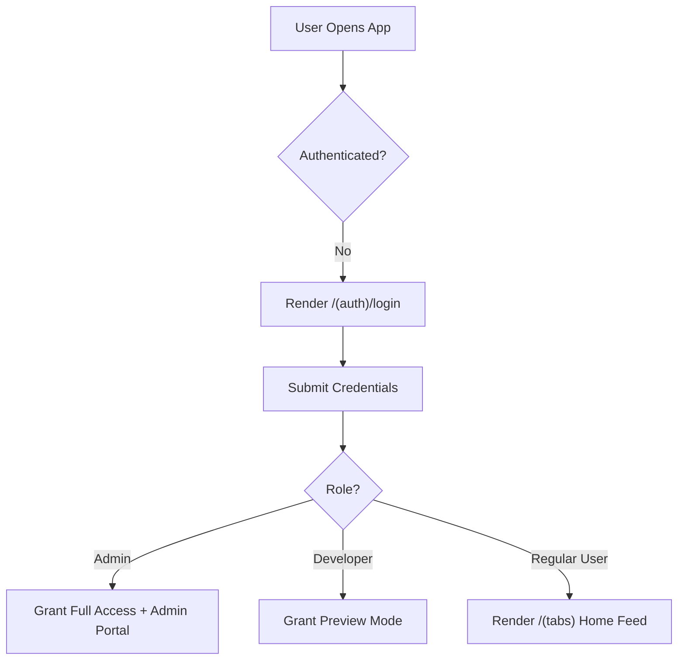
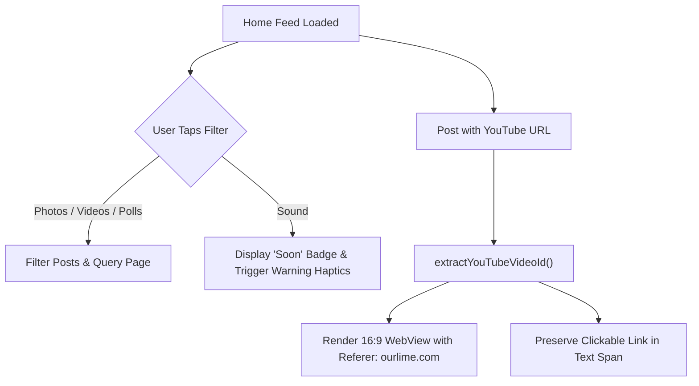
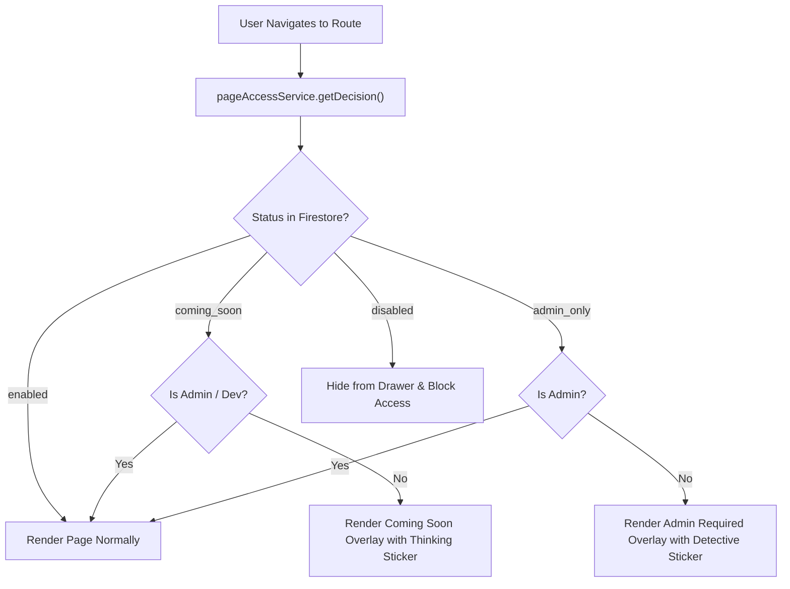
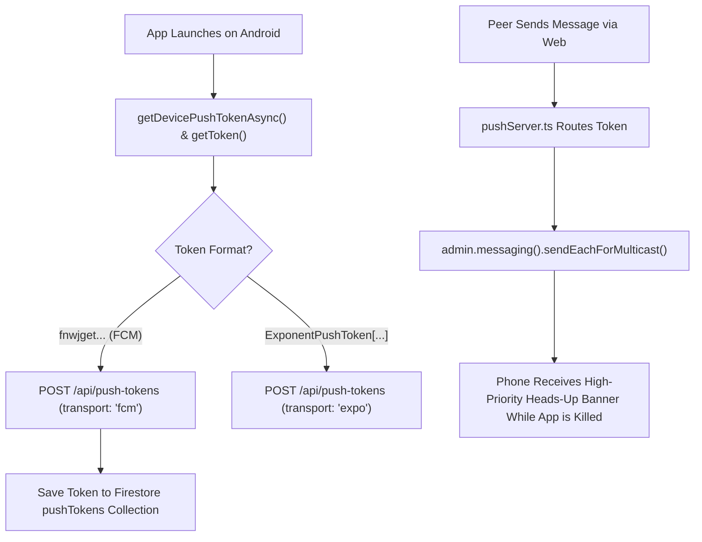

# Test Workflow Maps — Ourlime Mobile

Visual Mermaid user journey diagrams and test workflow maps for all mobile feature suites.

---

## 1. Authentication & Role Permissions Flow (`01-auth.test.ts`)

---

## 2. Feeds, Filters & YouTube Embed Flow (`02-feeds.test.ts`)

---

## 3. Real-Time Dynamic Page Access Flow (`10-page-access.test.ts`)

---

## 4. Push Notification Registration & Lockscreen Dispatch (`12-push-delivery.test.ts`)

